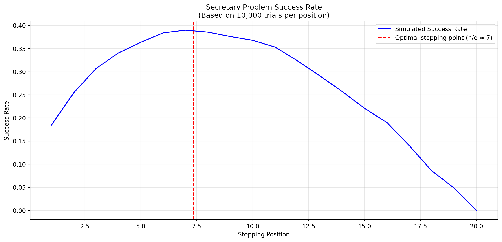

## Today's Topic: Optimal Stopping

**Topic:** Understanding optimal stopping problems and the famous "Secretary Problem"

**Why this matters:** Optimal stopping is everywhere in life - from hiring decisions to finding apartments to choosing when to sell stocks. Today we'll learn the mathematical strategy that maximizes your chances of making the best choice.

## Learning Objectives

By the end of this lecture, you will be able to:

1.  **Define** optimal stopping problems and identify them in real-world scenarios
2.  **Apply** the 37% rule (look-and-leap strategy) to make better decisions
3.  **Connect** optimal stopping principles to programming logic and algorithmic thinking

## Today's Agenda

1.  **What is Optimal Stopping?** - Definition and real-world examples
2.  **The Secretary Problem** - The classic formulation and solution
3.  **The 37% Rule** - Why it works and how to apply it
4.  **Variations & Extensions** - Rejection, time constraints, other scenarios
5.  **Connecting to Programming** - How this builds our algorithmic mindset

# <span class="flow">Optimal Stopping</span>

## What is Optimal Stopping?

<span class="question">Question:</span> Anybody know what optimal stopping is?

-   <span class="highlight">Optimal stopping</span> is the problem of:
    -   choosing the **best option**
    -   from a **sequence of options**
    -   where the options are revealed **one by one**

## 

Anybody an

example of

optimal stopping?

## <span class="invert-font">Flat Hunting</span>

<span class="invert-font">Photo by <a href="https://unsplash.com/@jiren_091">Aditya Ghosh</a> on Unsplash</span>

## <span class="invert-font">Hiring applicants</span>

<span class="invert-font">Photo by <a href="https://unsplash.com/@homajob">Scott Graham</a> on Unsplash</span>

## <span class="invert-font">Dating</span>

<span class="invert-font">Photo by <a href="https://unsplash.com/@shelbymary_">Shelby Deeter</a> on Unsplash</span>

# <span class="flow">"Secretary Problem"</span>

## The Secretary Problem

-   Imagine you're **hiring a secretary**
-   You must interview candidates **one by one**
-   Now, you must decide: **hire or continue searching**
-   Once you reject a candidate, **you cannot go back**
-   How to <span class="highlight">maximize chance of selecting the best candidate?</span>

. . .

> **Note**
>
> The name is a bit misleading, as the problem is not about hiring a secretary, but about finding the best candidate. It comes from the 1960s and thus a little outdated.

## Basic Setup

-   We have `n` candidates
-   We interview them **one by one**
-   We must decide to **hire or continue searching**
-   <span class="highlight">Ordinal ranking</span> of candidates

. . .

<span class="question">Question:</span> Anybody know what ordinal ranking is?

## Ways to fail

<span class="question">Question:</span> Anybody an idea how we can fail?

. . .

1.  Reject all candidates and never hire - <span class="highlight">stopping too late</span>
2.  You hire someone too early - <span class="highlight">stopping too early</span>

## 

Ideas?

## Look-and-Leap Strategy

The optimal strategy is to:

1.  Look at the <span class="highlight">first 37 %</span> of options
2.  Remember the **best one seen so far**
3.  Choose the next option that's **better than the best seen**
4.  Chance of selecting the best candidate is **37 %**[^1]
5.  Thus, we can fail with **63 %**!

## Look-and-Leap Strategy

The mathematically optimal strategy:

1.  **Look** at the <span class="highlight">first 37%</span> of candidates without hiring anyone
2.  **Remember** the best candidate from this observation phase
3.  **Leap:** Hire the next candidate who is **better than the best observed**
4.  **Success rate:** 37% chance of selecting the absolute best candidate

This means we fail 63% of the time - but this is the **best we can possibly do**!

## Step-by-step Approximation

Why does the success probability decrease with more candidates?

-   1 candidate: 100% (no choice!)
-   2 candidates: 50%
-   3 candidates: 33%
-   4 candidates: 25%
-   5 candidates: 20%

. . .

<span class="question">Question:</span> Do you see the pattern?

. . .

**Pattern:** 1/n - as we have more options, each individual option is less likely to be the best.

## Why 37%?

-   This is based on the **geometric distribution**
-   The <span class="highlight">optimal stopping point</span> is at `n/e`[^2]
-   `e` is the base of the natural logarithm (≈ 2.718)
-   This comes from maximizing the probability of success

. . .

## Computing the number

``` python
import math

percentage = 1/math.e
print(f"Percentage of options to look at: {percentage:.3f}%")

candidates = 20
lookout_phase = candidates/math.e
print(f"Look at first {lookout_phase:.3f} candidates")
```

    Percentage of options to look at: 0.368%
    Look at first 7.358 candidates

. . .

> **Note**
>
> No worries if you don't understand the code! We are essentialy just using the formula to calculate the percentage of candidates to look at.

## Geometric Distribution

Let's visualize the success of a simulation with 20 candidates:



# <span class="flow">Variations</span>

## Rejection

<span class="question">Question:</span> Imagine a dating scenario, <span class="highlight">where the other person can also reject you</span>. **Optimal stopping point?**

-   The optimal stopping point is now **lower**
-   Because we can now **fail more often**
-   With 50 % chance of rejection, we **start leaping at 25 %**
-   **Formula:** $q^{\frac{1}{1-q}}$ with $q$ being the chance of rejection

## Mutual Rejection

<span class="question">Question:</span> What if in dating, <span class="highlight">the other person can also reject you</span>?

-   The optimal stopping point **decreases**
-   We need to account for rejection risk
-   With 50% rejection probability: **start accepting at 25%**
-   **Formula:** $q^{\frac{1}{1-q}}$ where $q$ = rejection probability

. . .

**Life lesson:** Higher risk of rejection means we should be less picky!

## Time Constraints

What if we don't have a fixed number of candidates, but a <span class="highlight">fixed amount of time</span>?

. . .

**Example:** One year to find an apartment

. . .

<span class="question">Question:</span> How should we adapt our strategy?

. . .

-   **Same principle applies!** Observe for first 37% of available time
-   But now we also control the **search intensity**
-   This connects to **resource allocation** problems in computer science

## Other versions

-   Selling a house for the **best price** ("Threshold Rule")
-   Stealing with a **success probability** ("Burglar's Problem")
-   **Finding** a parking spot ("Parking Lot Problem") \[^2\]

. . .

> **Note**
>
> Side note for drivers: An increase in occupancy from 90 to 95% doubles the search time for all drivers!

## Building Your Technical Mindset

<span class="question">Question:</span> **How does optimal stopping connect to programming?**

. . .

1.  **Algorithmic thinking:** Break complex decisions into logical steps
2.  **Trade-off analysis:** Exploration vs. exploitation (fundamental in AI)
3.  **Mathematical optimization:** Using formulas to find best solutions

## Key Takeaways

**What we learned:**

1.  **Optimal stopping problems** are everywhere in life and business
2.  **The 37% rule** provides a mathematically optimal strategy
3.  **Exploration vs. exploitation** is a fundamental trade-off
4.  **Real-world variations** require adapting the basic strategy
5.  **This thinking** builds foundation for algorithmic problem-solving

## 

Any questions

so far?

## After the break --- Optimal Stopping

-   Gentle introduction to Python Programming
-   We work in our notebooks on basics and optimal stopping
-   How to translate the idea into code and experiments

. . .

> **Note**
>
> **That's it for optimal stopping!**  
> Let's have a short break and then continue with our first Python programming session.

# <span class="flow">Literature</span>

## Interesting literature to start

-   Christian, B., & Griffiths, T. (2016). Algorithms to live by: the computer science of human decisions. First international edition. New York, Henry Holt and Company.[^3]
-   Ferguson, T.S. (1989) 'Who solved the secretary problem?', Statistical Science, 4(3). doi:10.1214/ss/1177012493.

## Books on Programming

-   Downey, A. B. (2024). Think Python: How to think like a computer scientist (Third edition). O'Reilly. [Here](https://greenteapress.com/wp/think-python-3rd-edition/)
-   Elter, S. (2021). Schrödinger programmiert Python: Das etwas andere Fachbuch (1. Auflage). Rheinwerk Verlag.

. . .

> **Note**
>
> Think Python is a great book to start with. It's available online for free. Schrödinger Programmiert Python is a great alternative for German students, as it is a very playful introduction to programming with lots of examples.

## More Literature

For more interesting literature, take a look at the [literature list](../general/literature.qmd) of this course.

[^1]: Large number of candidates! With a small number of candidates, we can do even better.
    . . .

[^2]: This is a bit more advanced. We will not go into the details of the math here and focus more on the insights. For more details see Ferguson, T.S. (1989) 'Who solved the secretary problem?', Statistical Science, 4(3). doi:10.1214/ss/1177012493.

[^3]: The main inspiration for this lecture. Nils and I have read it and discussed it in depth, always wanting to translate it into a course.
