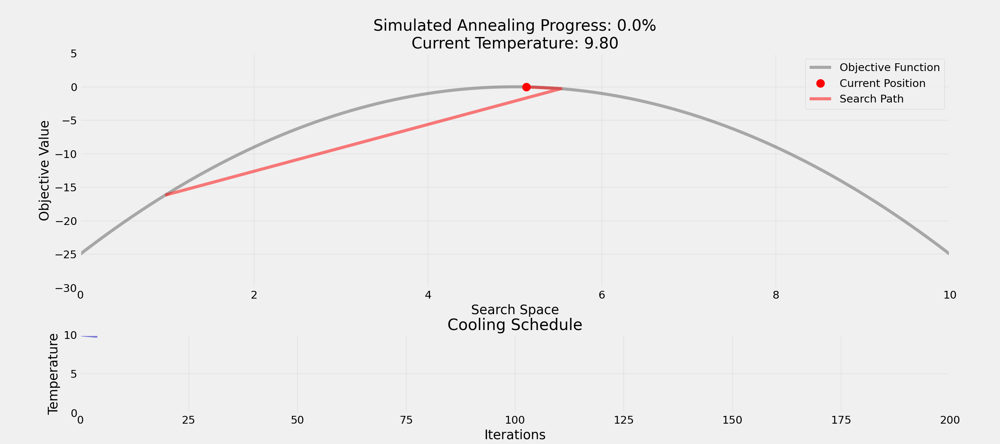

# <span class="flow">Understanding Randomness</span>

## Randomness

<span class="question">Question:</span> **What comes to your mind when you think of randomness?**

. . .

## <span class="invert-font">Casino</span>

## <span class="invert-font">Lottery</span>

## <span class="invert-font">Shuffling cards</span>

## <span class="invert-font">Algorithms</span>

## <span class="invert-font">Cryptography</span>

## <span class="invert-font">Genetic mutations</span>

## Why Randomness Matters

<span class="question">Question:</span> **What's the opposite of randomness?**

. . .

-   **Determinism**
-   **Predictability**
-   **Consistency**

. . .

-   <span class="highlight">Boredom?</span>

## Discovery by Randomness

<span class="question">Question:</span> **How would you test if a pair of dice is fair?**

. . .

-   Send the dice **to a lab** to <span class="highlight">check weight and balance</span>

. . .

-   Roll the dice **many times**
-   Check if the outcomes are **uniformly distributed**
-   Compare **observed** frequencies to **expected** frequencies

## Dice Rolls


## Using Randomness

-   Randomness is a <span class="highlight">fundamental aspect of the world</span>
-   It can be used for **discovery**
-   Randomness is used to model **uncertainty**
-   It is used to **explore** solutions and **avoid bias**

. . .

> **Important**
>
> Even in computer science, randomness is not just about **generating random numbers**!

# <span class="flow">Randomness in the World</span>

## Randomness and Everyday Life

<span class="question">Question:</span> **Where do you encounter randomness in daily life?**

## Social Life

-   Dating apps use **randomized matching** within preferences
-   **Random encounters** that lead to friendships
-   **Random opportunities** leading to career changes
-   **Breaking ties** through coin tosses

## Entertainment Industry

-   Pokémon's "random" encounters are **weighted by rarity**
-   **Loot systems:** Rare items have controlled drop rates
-   Chess AI introduces **randomness** to feel more human-like
-   Spotify's shuffle is **deliberately less random** to feel natural
-   TikTok uses **controlled randomization** to optimize discovery

## Cryptography

-   Coin miners solve **cryptographic puzzles** using guesses
-   PW generators balance **randomness and memorability**
-   `correct-horse-battery-staple` is secure
-   `Tr0ub4dor&3` is less secure despite looking complex
-   <span class="highlight">Modern encryption</span> uses random numbers

## Data Science

-   **Weather forecasting** uses randomness for uncertainty
-   **Stock algorithms** add randomness to avoid patterns
-   **Self-driving cars** add randomness <span class="highlight">for natural-feeling</span>
-   **Random sampling** in research for unbiased results

. . .

> **Note**
>
> Randomness is <span class="highlight">everywhere</span> around us!

# <span class="flow">Randomness and Computer Science</span>

## Randomness in Computer Science

-   **Fundamental concept** in computer science
-   Helps solve "hard" problems **efficiently**
-   Often **faster than deterministic approaches**
-   <span class="highlight">Trade-off:</span> Optimal vs. "Good Enough" solutions

. . .

> **Important**
>
> Sometimes a quick "good enough" solution is better than waiting for the perfect one.

## Types of Randomness

<span class="question">Question:</span> **Difference between true and pseudo-randomness?**

. . .

<span class="highlight">True Randomness</span>

-   Physical phenomena
-   Atmospheric noise
-   Radioactive decay
-   Quantum effects

<span class="highlight">Pseudo-randomness</span>

-   Deterministic algorithms
-   Seed-based generation
-   Repeatable sequences
-   Good enough for most uses

## Limits of Computation

<span class="question">Question:</span> **How many possible combinations exist in a shuffled deck of cards?**

``` python
import math
print(math.factorial(52))
```

    80658175170943878571660636856403766975289505440883277824000000000000

. . .

> **Important**
>
> Computing and evaluating all possible combinations is not feasible!

## Addressing Computational Limits

<span class="question">Question:</span> **Anybody ever heard of "Monte Carlo methods"?**

. . .

-   Developed in the **1940s for nuclear weapons research**
-   Nuclear fission chain reactions **were too complex**
-   Helped to <span class="highlight">evaluate the probabilities of different outcomes</span>
-   Named after **Monaco's famous casino**

. . .

<span class="question">Question:</span> **How could we estimate π?**

## Estimating π


# <span class="flow">Decision Making</span>

## Travel Itinerary

<span class="question">Question:</span> **How and in which order would you visit 10 cities by plane with minimal total distance?**

``` python
import math
print(math.factorial(10))
```

    3628800

. . .

<span class="question">Question:</span> **What could be a strategy?**

## Brute Force

-   Try <span class="highlight">every possibility</span>
-   Total possible routes: 10! = **3,628,800**
-   **Guaranteed** to find best solution
-   If each check takes 1ms: **1 hour** to check all routes

. . .

<span class="question">Question:</span> **What could be the problem with this approach?**

## Time and Space Requirements

-   For 20 cities: 20! = **2.4 quintillion** routes
-   Would take **77 billion years** at 1ms per check!
-   **Time complexity** grows <span class="highlight">factorially</span>
-   **Memory requirements** increase with problem size

. . .

> **Important**
>
> **Not feasible for real-world problems!**

## Greedy Algorithm

-   **Example:** Always picking shortest next flight
-   Make **locally optimal** choices at each step
-   <span class="highlight">Never backtracks or reconsiders past decisions</span>
-   Fast execution & simple to implement
-   Can perform **poorly on complex problems**

## Hill Climbing

-   <span class="highlight">Iteratively improve solution</span> by making small changes
-   Like **climbing in fog**, can only see immediate surroundings
-   Don't know if **higher peaks** exist elsewhere
-   Can get stuck in **local optima**
-   No guarantee of finding **global best optima**

. . .

<span class="question">Question:</span> **How would you escape a local optimum?**

## Simulated Annealing

-   Make random changes and **accept improvements**
-   Sometimes accept **worse solutions**
-   Gradually become **more selective**

. . .

<span class="question">Question:</span> **Why accept worse solutions sometimes?**

. . .

-   Randomness helps to escape **local optima**
-   Balances <span class="highlight">exploration vs. exploitation</span>

## Simulated Annealing Animation



## Traveling Salesman


# <span class="flow">Randomness and Society</span>

## Thought Experiment

**What's more important for a society?**

. . .

<span class="highlight">Freedom</span>

-   Individual choice
-   Personal responsibility
-   Market-driven

<span class="highlight">Equality</span>

-   Shared resources
-   Social safety nets
-   Regulated systems

. . .

<span class="question">Question:</span> **Any problem with this question?**

## Veil of Ignorance

You might <span class="highlight">randomly</span> be:

-   Any gender identity and economic status
-   Any health condition and intelligence level
-   Any cultural background and religious belief

. . .

<span class="question">Question:</span> **If you didn't know who you'd be born as, what kind of society would you design?**

## Key Considerations

-   **Individual stories:** Powerful but potentially misleading
-   **Statistics:** Comprehensive but can miss nuance
-   **Hidden diversity:** Important subgroups may be overlooked
-   **Small policy changes** <span class="highlight">can have cascading effects</span>

. . .

> **Important**
>
> But that's not all! We also need to measure **success** and **failure**!

## Measuring Success

-   **Mean happiness:** Average well-being
-   **Total happiness:** Utilitarian approach
-   **Median happiness:** Focus on the middle class
-   **Minimum happiness:** Protecting the most vulnerable

. . .

<span class="question">Question:</span> **What could be the problem with these measures?**

## Idea: Random Sampling

-   Randomly <span class="highlight">select a subset of the population</span>
-   Gather **diverse perspectives** from the sample
-   Better understand **needs** of population
-   **Reduce selection bias** and improve accuracy

. . .

<span class="question">Question:</span> **What is a selection bias?**

## Selection Bias

**Definition**: Selection bias occurs when the sample data you're analyzing <span class="highlight">isn't truly representative of the population</span> you're trying to study.

. . .

> **Famous Example**
>
> During WWII, engineers studied returning planes to determine where to add armor. Initially, they focused on areas with most bullet holes. Abraham Wald pointed out they should instead armor the areas with *no* bullet holes - those were the critical areas where planes didn't survive to return!

## Promoting Fairness

<span class="question">Question:</span> **How can randomness promote fairness?**

. . .

-   **Random allocation** of patients in clinical trials
-   **Random audits** for tax compliance
-   **Random assignment** of cases to judges
-   **Random order** of candidates on voting ballots

# <span class="flow">Uncertainty</span>

## Quick Poll

<span class="question">Question:</span> **Which would you prefer?**

-   **100% chance of winning 50 EUR**
-   **50% chance of winning 120 EUR**

. . .

> **Tip**
>
> Answer depends on your **risk aversion**!

## Decisions Under Uncertainty

<span class="question">Question:</span> **When should we embrace vs. reduce randomness?**

. . .

<span class="highlight">Embrace When</span>:

-   Exploring new solutions
-   Avoiding bias
-   Breaking deadlocks
-   Testing systems

<span class="highlight">Reduce When</span>:

-   Safety-critical systems
-   Financial transactions
-   Medical procedures
-   Legal proceedings

# <span class="flow">Takeaways</span>

## "Good Enough" Solutions

-   **Perfect is enemy of good**
    -   Remember Monte Carlo methods: **approximations work**
    -   Complete analysis often impossible
    -   <span class="highlight">Perfect information is rare</span>

. . .

> **Tip**
>
> Many real-world problems benefit from **embracing uncertainty** rather than fighting it!

## Opportunity Costs

-   <span class="highlight">Consider opportunity costs</span>
    -   Quick approximations enable faster decisions
    -   Balance accuracy vs. computation time
    -   Random sampling vs. complete enumeration

. . .

> **Tip**
>
> Many problems benefit from **fast, good-enough solutions** rather than perfect ones.

## The End

> **Note**
>
> **That's it for today's lecture!**  
> We've covered the basics of randomness and its applications. In the upcoming tutorials, we'll learn how to use LLMs to generate code with randomness.

# <span class="flow">Literature</span>

## Interesting literature to start

-   Christian, B., & Griffiths, T. (2016). Algorithms to live by: the computer science of human decisions. First international edition. New York, Henry Holt and Company.[^1]

## Books on Programming

-   Downey, A. B. (2024). Think Python: How to think like a computer scientist (Third edition). O'Reilly. [Here](https://greenteapress.com/wp/think-python-3rd-edition/)
-   Elter, S. (2021). Schrödinger programmiert Python: Das etwas andere Fachbuch (1. Auflage). Rheinwerk Verlag.

. . .

> **Note**
>
> Think Python is a great book to start with. It's available online for free. Schrödinger Programmiert Python is a great alternative for German students, as it is a very playful introduction to programming with lots of examples.

## More Literature

For more interesting literature, take a look at the [literature list](../general/literature.qmd) of this course.

[^1]: The main inspiration for this lecture. Nils and I have read it and discussed it in depth, always wanting to translate it into a course.
